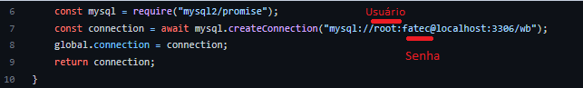

<div align="center" id="menu">
    <h1>Atv IV - WB TypeScript</h1>
    <p> TypescriptProjects-CEF&JSG </p>
    <p>
    <a href="#sobre">Sobre a atividade</a> | 
    <a href="#manual">Manual do usuário</a> |
    <a href="#pastas">Configuração das pastas</a> | 
  	<a href="#tecnologias">Tecnologias</a> |
    <a href="#equipe">Equipe</a>
</p>
</div>


<br>

<h2 id="sobre">📝Sobre a atividade</h2>

<p>Trata-se de uma atividade proposta pelo Professor Dr. Eng. Gerson Penha para testar a competência de seus alunos quanto aos conhecimentos necessários para a conclusão da disciplina de Técnica de Programação I. </p>

<p>Nessa atividade foi exigido que se realizasse uma comunicação entre front-end e back-end, para que treinássemos nossas habilidades de desenvolvimento e integração front-end e back-end.</p>

<a href="#menu">Voltar ao menu </a>


<h2 id="manual"> 📜Manual do Usuário </h2>

Requisitos: ter instalado o Node JS e o MySQL.

1.Criar uma pasta e clonar o repositório com o seguinte comando no cmd: </li>

```
git clone https://github.com/TypescriptProjects-JSG/atviv-typescript
```

2.Alterar as informações da linha 7 do arquivo index.js, de acordo com a configuração do seu banco de dados, executar o arquivo banco.sql no MySQL.



3.Entrar na pasta do projeto (cd atviv-typescript) e executar:

```
cd back
npm install
node index.js
```

4.Abrir outro terminal, entrar na pasta do projeto (cd atviv-typescript) e executar:

```
cd front
npm install
npm start
```

<a href="#menu">Voltar ao menu </a>


<h2 id="pastas"> 🗂Configuração das pastas</h2>

<ul>
    <li>back: pasta com o arquivo sql e arquivo index.js</li>
    <li>front: </li>
    <ul>
        <li> public: pasta com o arquivo index.html e o favicon</li>
    	<li> src: pasta com as pastas pages e component mais os arquivos index.css e index.tsx </li>
    </ul>
    <li>img: pasta com a imagem usada no readme</li>
</ul>


 <a href="#menu">Voltar ao menu </a>


<h2 id="tecnologias">🛠Tecnologias Utilizadas</h2>

<ul> 
    <li> TypeScript</li>
    <li> JavaScript</li>
    <li> React JS </li>
    <li> Node Js </li>
    <li> HTML </li>
    <li> CSS </li>
    <li> Github </li>
    <li> Discord </li>
    <li> Visual Studio Code</li>
</ul>


<a href="#menu">Voltar ao menu</a>


<h2 id="equipe">👥 Equipe</h2>

|      | Nome                    |
| ---- | ----------------------- |
| 1    | Carlos Eduardo Falandes |
| 2    | Júlia Sousa Gayotto     |

 <a href="#menu">Voltar ao menu </a>

